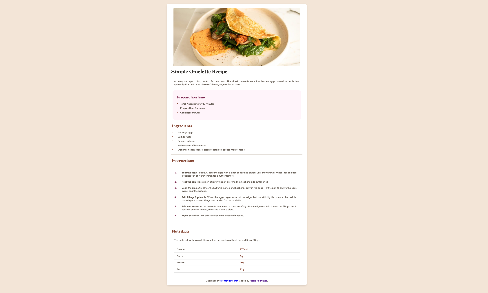

# Frontend Mentor - Recipe page solution

This is my solution to the [Recipe page challenge on Frontend Mentor](https://www.frontendmentor.io/challenges/recipe-page-KiTsR8QQKm). This challenge helped me improve my HTML and CSS skills by creating a clean and responsive recipe page.

## Table of contents

- [Overview](#overview)
  - [Screenshot](#screenshot)
  - [Links](#links)
- [My process](#my-process)
  - [Built with](#built-with)
  - [What I learned](#what-i-learned)
  - [Continued development](#continued-development)
  - [Useful resources](#useful-resources)
- [Author](#author)
- [Acknowledgments](#acknowledgments)

## Overview

### Screenshot



### Links

- Solution URL: [Frontend Mentor Solution](https://www.frontendmentor.io/solutions/recipe-page)
- Live Site URL: [Live Website](https://yourusername.github.io/recipe-page/)

## My process

### Built with

- Semantic HTML5
- CSS custom properties (variables)
- Flexbox
- Grid layout
- Mobile-first workflow
- Basic responsiveness

### What I learned

This project helped me reinforce my understanding of semantic HTML and CSS layout techniques like **Flexbox** and **Grid**. I also practiced CSS selectors like `nth-child()` to style specific elements, such as the numbers in the table.

Example of styling only the numbers in a table:

```css
table td:nth-child(2) {
  color: #854632;
  font-weight: bold;
}
